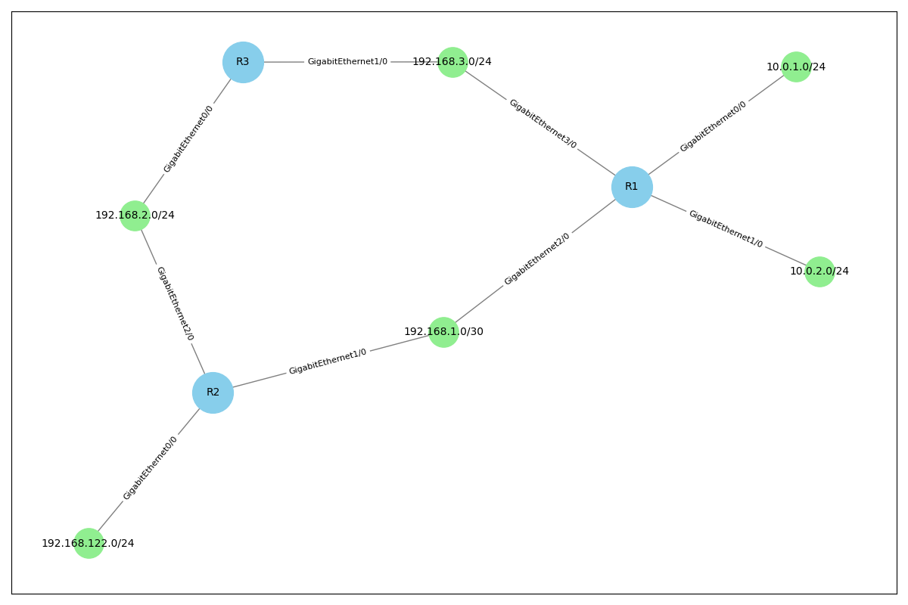
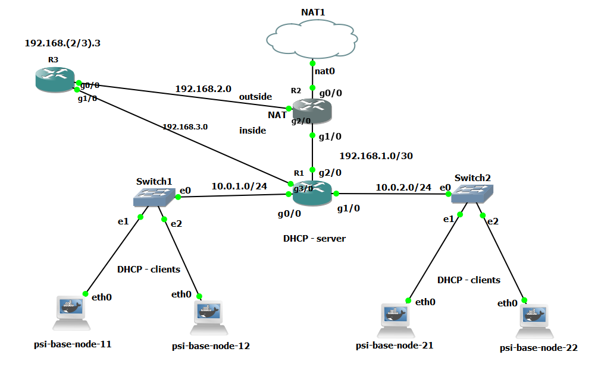

# Net Topologger

Zjišťuje topologii sítě pomocí protokolu SNMP. Síťová topologie je určena z obsahu směrovacích tabulek směrovačů a rozhrani.


## Příklad výstupu:
Výstup:

Struktura v GNS:


## Funkcionalita

Aplikace provádí následující kroky:
1. **Detekce výchozí brány:** Pomocí protokolu DHCP se zjistí IP adresa výchozího směrovače. DHCP Packet je postaven pomocí Scapy.
    - `gateway.py`
2. **Získání směrovacích tabulek:** Z výchozího směrovače se rekurzivně získávají směrovací tabulky dalších směrovačů v síti (nextHop). (`1.3.6.1.2.1.4.21.1`) Pokud router neodpovida na SNMP, je preskocen.
    - `snmp.py`
3. **Detekce rozhraní:** Informace o rozhraních směrovačů z OID `1.3.6.1.2.1.4.20.1`.
    - `top.py`
4. **Reprezentace topologie:** Topologie je vizualizována pomocí grafu s routery a sítěmi.
    - `top.py`

### Příklad pro získání SNMP tabulky
Pomocí SNMP walk projde route tabulku.   
Vrací list záznamů tabulky, poslední argument je mapování OID sloupců na lidsky čitelné řetězce.
```python
host = "192.168.1.254"
mapping = {"1":"destination","2":"interface","3":"metric","7":"nextHop","8":"type","11":"mask"}

t = getTable("1.3.6.1.2.1.4.21.1", host, mapping)
# t: [ 
#       {
#           destination: 192.168.1.3,
#           interface: 0,
#           metric: 42,
#           nextHop: 192.168.2.3,
#           mask: 255.255.255.0
#       },
#       { 
#           ....
#       }
# ]
print(t[0].nDestination, t[0].nMask, t[0].nInterface, ...) # ...
printTable(t) # ->
# Destination  Interface  Metric  NextHop      Type  Mask           
# 0.0.0.0      0          0       192.168.3.1  4     0.0.0.0        
# 192.168.2.0  2          0       192.168.2.3  3     255.255.255.0  
# 192.168.2.3  2          0       192.168.2.3  3     255.255.255.255
# 192.168.3.0  3          0       192.168.3.3  3     255.255.255.0  
# 192.168.3.3  3          0       192.168.3.3  3     255.255.255.255
```

## Použité technologie

- **Knihovny:**
  - [Scapy](https://scapy.net/) pro práci s DHCP a paketovými operacemi.
  - [PySNMP](https://pysnmp.readthedocs.io/en/latest/) pro komunikaci s protokolem SNMP.
  - [networkx](https://networkx.org/) pro vytvoření grafové struktury
  - [matplotlib](https://matplotlib.org/) pro vytisknutí grafu 
- **GNS3 projekt:** Aplikace byla testována na GNS3 projektu dostupném [zde](https://home.zcu.cz/~maxmilio/PSI/psi-example-project-1.gns3project).


**OID**: https://oid-rep.orange-labs.fr/cgi-bin/display?tree=1.3.6.1.2.1.4.21.1#focus

## Požadavky

- GNS3 psi-base-node
- `pip install -r requirements.txt`


## Instalace a spuštění
```bash
git clone https://github.com/Cooble/PSI_netlogger
cd PSI_netlogger
pip install -r requirements.txt
python top.py # generates network_topology.png
```
